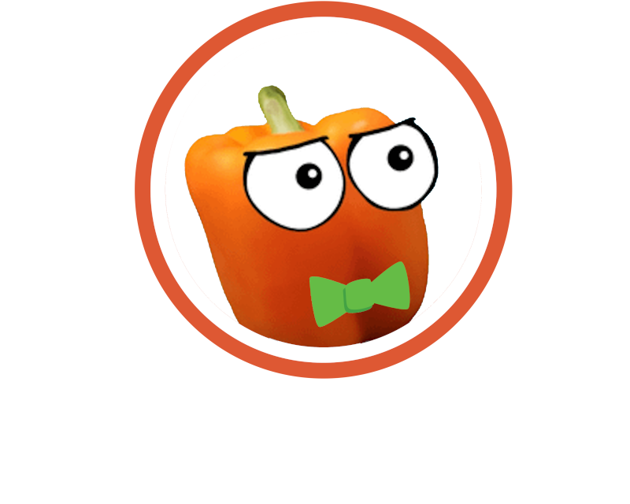

# **DougDougGo**

## **DougDougGo is an extension that adds the famous streamer DougDoug's elements into duckduckgo.com**
## Changes Include:
 - changes all DuckDuckGo logos into DougDougGo
 - changes favicon
 - if the user's search include "ike" will play "You just searched ike, dumbass", adds that text, and change the favicon

 > [!IMPORTANT]
 > # DougDougGo ublocklist
 > - To make the text show you'll have to install this blocklist. You can also checkout my [custom script](https://subscribe.adblockplus.org/?location=https://raw.githubusercontent.com/olivertzeng/dotfiles/master/ublocklist.txt&title=Oliver Tzeng's Custom Blocklist). But [here](https://subscribe.adblockplus.org/?location=https://raw.githubusercontent.com/olivertzeng/DougDougGo/main/dougdouggo.txt&title=DougDougGo Blocklist) is the most basic script to hide duckduckgo's annoyances for basic addon functionality.
 > Instructions: Install [uBlock
 > Origin](https://addons.mozilla.org/zh-TW/firefox/addon/ublock-origin/?utm_source=addons.mozilla.org&utm_medium=referral&utm_content=search)
 > from FireFox addon store and click the link above. It'll then direct you to my blocklist. Click
 > "Subscribe" at the top right corner and you're done!
 > - Remeber to enable autoplay in about:preferences

## TODO:
 - include settings to disable the sound effect if the user searches ike
 - change aichat's text to Babagaboosh
 - Notification when user searches for smash bros

**DougDougGo is now your new search engine!**
* Also check out DougDougify by [MagicJinn](https://github.com/MagicJinn/) [here](https://addons.mozilla.org/zh-TW/firefox/addon/youtube-dougdougify/)

## Thanks to
 - DougDoug for inspirement
 - MagicJin being a tester, a supporter, an artist who made the extension icon, and a nice guy who makes DougDougify(and MrBeastify as
   well!)

## Disclamer
 - This project has nothing to do with Duck Duck Go, Inc.
 - I won't make a Chrome version for now because I don't want to pay for 5 dollars just to support
   the platform I don't use. You are free to rehost it on the Chrome Extension Store as long as you
   credit my name Oliver Tzeng.

**Issues and suggestions are welcomed**
